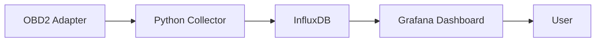

# Architecture diagram

```mermaid
flowchart LR
    OBD[OBD2 Adapter] --> Collector[Python Collector]
    Collector --> Influx[InfluxDB]
    Influx --> Grafana[Grafana Dashboard]
    Grafana --> User[User]
```

This diagram shows the intended end-to-end flow for the telemetry pipeline project.
